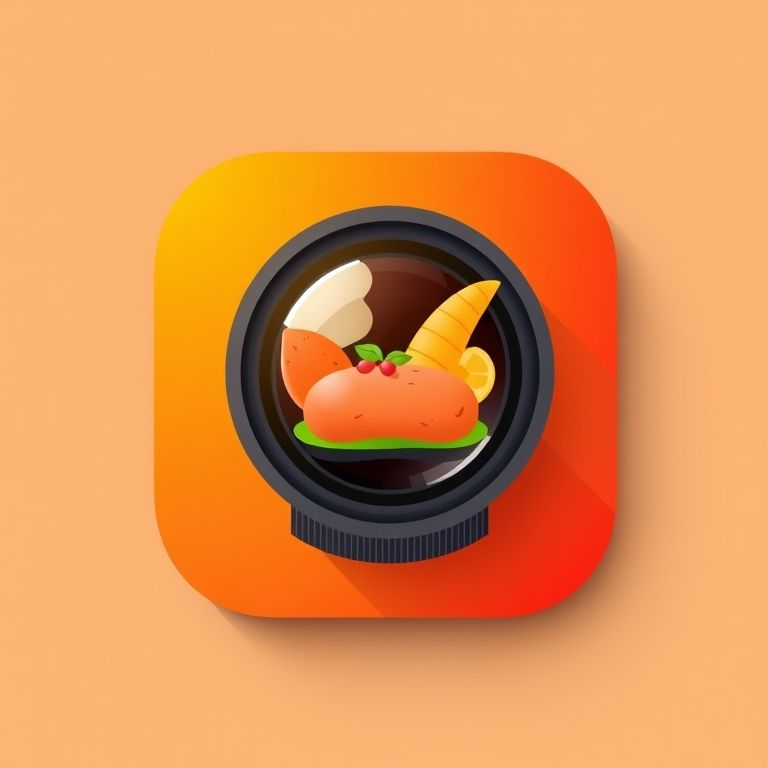
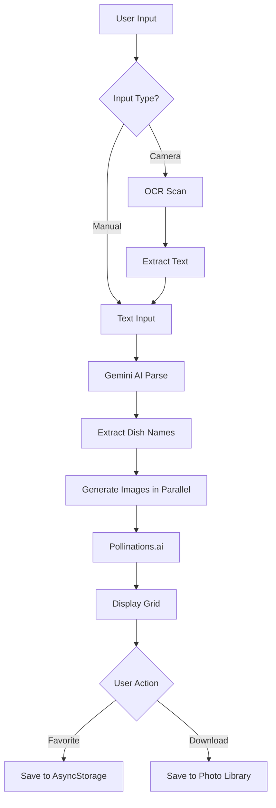

# Virtual Food Photographer 📸🍽️

<div align="center">
  

  <p><strong>Transform restaurant menus into stunning AI-generated food photography</strong></p>

  [](https://reactnative.dev/)
  [](https://expo.dev/)
  [](https://www.typescriptlang.org/)
  [](LICENSE)
</div>

---

## 📱 Overview

**Virtual Food Photographer** is a cross-platform mobile application that revolutionizes how restaurants and food businesses showcase their menu items. Simply type or scan a restaurant menu, choose a photography style, and watch as AI generates professional-quality food photos for each dish.

<div align="center">
  
  <p><em>Professional food photography meets cutting-edge AI</em></p>
</div>

### Why Virtual Food Photographer?

- **Cost-Effective**: No need for expensive food photography sessions
- **Fast**: Generate dozens of professional photos in seconds
- **Flexible**: Three distinct photography styles to match your brand
- **Mobile-First**: Works on both iOS and Android devices
- **Offline Capable**: Save favorites for offline viewing

---

## ✨ Features

### 🎯 Core Features

- **📝 Smart Menu Input**
  - Type menu items manually with an intuitive text editor
  - Scan physical menus using your camera with OCR technology
  - Intelligent AI parsing extracts dish names automatically
  - Clear button for quick menu reset with confirmation

- **🤖 AI-Powered Image Generation**
  - Generate professional food photography in seconds
  - **Three Photography Styles:**
    - **Rustic/Dark** - Moody, dramatic lighting with rich shadows
    - **Bright/Modern** - Clean, contemporary, well-lit presentation
    - **Social Media** - Instagram-ready, eye-catching compositions
  - Parallel image generation for lightning-fast results
  - Automatic retry functionality for failed images
  - Real-time generation status indicators

- **❤️ Favorites Management**
  - Save your favorite generated images with a tap
  - Persistent storage across app sessions (AsyncStorage)
  - Dedicated Favorites tab for easy access
  - Download individual images or batch download all
  - Progress tracking for multi-image downloads
  - Images saved to device-specific photo album

- **📸 Camera Integration**
  - Launch camera directly from the app
  - Capture menu photos with editing capabilities
  - Automatic text extraction from images (OCR)
  - Extracted text appends to existing input

- **🎨 User Experience**
  - Beautiful dark theme with elegant orange/amber gradients
  - Smooth animations and transitions
  - Haptic feedback for downloads and interactions
  - Comprehensive error handling with user-friendly messages
  - Tab-based navigation for intuitive flow
  - Loading states with animated spinners
  - Empty state messaging

---

## 🖼️ Screenshots

<div align="center">

| Splash Screen | Main Interface | Favorites |
|--------------|----------------|-----------|
|  | Coming Soon | Coming Soon |

</div>

---

## 🛠️ Technology Stack

### Core Framework

```
React Native 0.76.5
    ↓
Built with Expo ~52.0.0
    ↓
TypeScript 5.8.2
```

### Key Technologies

| Category | Technology | Purpose |
|----------|-----------|---------|
| **Mobile Framework** | React Native 0.76.5 | Cross-platform mobile development |
| **UI Library** | React 18.3.1 | Component-based UI |
| **Development Platform** | Expo ~52.0.0 | Tooling & services |
| **Navigation** | Expo Router ~4.0.0 | File-based routing with tabs |
| **Language** | TypeScript 5.8.2 | Type safety |
| **Styling** | StyleSheet API | Native styling |
| **State Management** | React Context + Hooks | Global state |
| **Storage** | AsyncStorage 1.23.1 | Persistent favorites |

### UI & Visual

- **expo-linear-gradient 14.0.1** - Gradient components
- **react-native-svg 15.8.0** - Custom SVG icons
- **expo-status-bar** - Status bar styling
- **react-native-safe-area-context** - Safe area handling

### Device Features

- **expo-image-picker 16.0.6** - Camera & image selection
- **expo-media-library 17.0.6** - Photo library access
- **expo-file-system 18.0.3** - File operations & base64 conversion
- **expo-haptics 14.0.1** - Touch feedback
- **expo-sharing 13.0.1** - Share functionality

### AI & APIs

- **Google Gemini AI** (@google/genai ^1.26.0)
  - Model: Gemini 2.5 Flash
  - Menu parsing with structured JSON output
  - OCR for scanned menus

- **Pollinations.ai** (Free Image Generation)
  - Photorealistic food photography
  - No API key required
  - No rate limiting
  - Multiple style support

### Utilities

- **react-native-get-random-values** - Crypto polyfill for UUIDs
- **expo-constants** - Environment configuration
- **expo-linking** - Deep linking support

---

## 🚀 Getting Started

### Prerequisites

- **Node.js** v18 or higher
- **npm** or **yarn** package manager
- **Expo CLI** (via npx or global install)
- **Google Gemini API Key** - [Get one here](https://makersuite.google.com/app/apikey) (Free tier available)

### For Android Development
- Android Studio with Android SDK
- Android emulator or physical device
- Works on macOS, Windows, or Linux

### For iOS Development
- macOS with Xcode 14 or later
- iOS Simulator or physical iOS device
- Apple Developer account (for physical devices)

---

## 📦 Installation

### 1. Clone the Repository

```bash
git clone https://github.com/yourusername/virtual-food-photographer.git
cd virtual-food-photographer
```

### 2. Install Dependencies

```bash
npm install
```

### 3. Configure Environment

Create a `.env` file in the root directory:

```bash
echo "EXPO_PUBLIC_GEMINI_API_KEY=your-api-key-here" > .env
```

Replace `your-api-key-here` with your actual Google Gemini API key from [Google AI Studio](https://makersuite.google.com/app/apikey).

**Important:**
- Environment variables must start with `EXPO_PUBLIC_` prefix
- Never commit `.env` file to version control (already in `.gitignore`)
- The key is free to obtain and has generous rate limits

### 4. Verify Installation

```bash
npm start
```

This will start the Expo development server and open Expo Dev Tools in your browser.

---

## 💻 Development

### Running the App

**Start Development Server:**
```bash
npm start
```

**Run on Android:**
```bash
npm run android
```

**Run on iOS (macOS only):**
```bash
npm run ios
```

**Run on Web:**
```bash
npm run web
```

### Testing on Physical Device

1. **Install Expo Go** on your phone:
   - [iOS App Store](https://apps.apple.com/app/expo-go/id982107779)
   - [Google Play Store](https://play.google.com/store/apps/details?id=host.exp.exponent)

2. **Scan QR Code:**
   - iOS: Use Camera app
   - Android: Use Expo Go app

### Debugging

- **React Native Debugger** - Standalone debugging tool
- **Chrome DevTools** - For JavaScript debugging
- **Expo Dev Tools** - Access via browser
- **Console Logs** - View in terminal
- **Error Overlays** - Shown in app

---

## 📖 Usage Guide

### 1. Input Menu

**Manual Entry:**
- Type or paste menu items into the text input
- One dish per line or comma-separated
- Example:
  ```
  Caesar Salad
  Grilled Salmon with Lemon Butter
  Chocolate Lava Cake
  ```

**Camera Scan:**
- Tap the camera icon
- Grant camera permission
- Capture a photo of the menu
- AI automatically extracts text via OCR
- Extracted text appends to existing input

**Clear Menu:**
- Tap the X button to clear
- Confirmation dialog prevents accidental clearing

### 2. Choose Photography Style

Select one of three professional styles:

- **Rustic/Dark** 🌙
  - Moody, dramatic lighting
  - Rich shadows and warm tones
  - Perfect for upscale, artisanal restaurants

- **Bright/Modern** ☀️
  - Clean, contemporary presentation
  - Bright, even lighting
  - Ideal for casual dining and cafes

- **Social Media** 📱
  - Eye-catching, Instagram-ready
  - Vibrant colors and composition
  - Optimized for sharing online

### 3. Generate Photos

1. Tap the **"Generate Photos"** button
2. AI parses your menu and extracts dish names
3. Images generate in parallel (all at once)
4. Watch real-time status:
   - ⏳ Generating - Image being created
   - ✅ Completed - Image ready
   - ❌ Failed - Error occurred (tap retry)

### 4. Save Favorites

- Tap the ❤️ heart icon on any image
- Heart fills in to show it's saved
- Access all favorites in the **Favorites tab**
- Favorites persist across app sessions

### 5. Download Images

**From Favorites Tab:**

**Individual Download:**
- Tap download icon on any favorite
- Image saves to device photo library
- Haptic feedback confirms success

**Batch Download:**
- Tap "Download All" button
- Progress indicator shows status
- All favorites saved at once
- Organized in "VirtualFoodPhotographer" album

---

## 🏗️ Architecture

### Application Flow



### State Management Architecture

```
┌─────────────────────────────────────┐
│         App Component               │
│  (Local State: menu, style, dishes) │
└─────────────┬───────────────────────┘
              │
              ↓
┌─────────────────────────────────────┐
│      FavoritesContext               │
│  (Global State: favorites array)    │
│  - addFavorite()                    │
│  - removeFavorite()                 │
│  - toggleFavorite()                 │
│  - isFavorite()                     │
└─────────────┬───────────────────────┘
              │
              ↓
┌─────────────────────────────────────┐
│         AsyncStorage                │
│  (Persistent Storage: @favorites)   │
└─────────────────────────────────────┘
```

### Component Hierarchy

```
App (_layout.tsx)
├── FavoritesProvider
│   └── Tabs Navigation
│       ├── Home Tab (index.tsx)
│       │   ├── MenuInput
│       │   │   ├── TextInput
│       │   │   ├── Camera Button
│       │   │   └── Clear Button
│       │   ├── StyleSelector
│       │   │   └── Radio Buttons
│       │   ├── Generate Button
│       │   └── ImageGrid
│       │       └── ImageCard[]
│       │           ├── Image
│       │           ├── Favorite Button
│       │           └── Retry Button
│       │
│       └── Favorites Tab (favorites.tsx)
│           ├── Download All Button
│           └── ImageGrid
│               └── ImageCard[]
│                   ├── Image
│                   └── Download Button
```

---

## 📁 Project Structure

```
virtual-food-photographer/
│
├── app/                              # Expo Router pages (file-based routing)
│   ├── _layout.tsx                   # Root layout with tabs + FavoritesProvider
│   ├── index.tsx                     # Home screen (menu input & generation)
│   └── favorites.tsx                 # Favorites screen (saved images)
│
├── components/                       # Reusable React Native components
│   ├── MenuInput.tsx                 # Text input with camera & clear buttons
│   ├── StyleSelector.tsx             # Radio buttons for style selection
│   ├── ImageGrid.tsx                 # FlatList grid for generated images
│   ├── ImageCard.tsx                 # Individual dish card with states
│   ├── ConfirmDialog.tsx             # Confirmation modal dialog
│   └── icons/                        # Custom SVG icons
│       ├── SparklesIcon.tsx          # Generate button icon
│       ├── LoaderIcon.tsx            # Loading spinner
│       ├── RefreshIcon.tsx           # Retry icon
│       ├── HomeIcon.tsx              # Home tab icon
│       └── HeartIcon.tsx             # Favorites icon
│
├── contexts/                         # React Context providers
│   └── FavoritesContext.tsx          # Global favorites state + AsyncStorage
│
├── services/                         # External API integration
│   └── geminiService.ts              # AI service layer
│       ├── parseMenu()               # Extract dishes from text (Gemini)
│       ├── extractTextFromImage()    # OCR for camera scans (Gemini)
│       └── generateFoodImage()       # Generate images (Pollinations.ai)
│
├── assets/                           # Static assets
│   ├── icon.png                      # App icon (1024x1024)
│   ├── splash.png                    # Splash screen
│   ├── adaptive-icon.png             # Android adaptive icon
│   ├── favicon.png                   # Web favicon
│   └── README.md                     # Asset specifications
│
├── android/                          # Android native code
│   └── app/
│       └── src/
│           └── main/
│               ├── res/              # Android resources
│               └── AndroidManifest.xml
│
├── ios/                              # iOS native code (when built)
│
├── types.ts                          # TypeScript type definitions
├── app.json                          # Expo configuration
├── babel.config.js                   # Babel configuration
├── metro.config.js                   # Metro bundler config
├── tsconfig.json                     # TypeScript configuration
├── package.json                      # Dependencies & scripts
├── .env                              # Environment variables (git-ignored)
├── .gitignore                        # Git ignore rules
├── CLAUDE.md                         # AI assistant guidance
└── README.md                         # This file
```

### Key Files Explained

| File | Purpose | Key Features |
|------|---------|--------------|
| **app/index.tsx** | Home screen | Menu input, style selection, image generation, retry logic |
| **app/favorites.tsx** | Favorites screen | Display saved images, individual/batch downloads |
| **services/geminiService.ts** | AI integration | Menu parsing, OCR, image generation APIs |
| **contexts/FavoritesContext.tsx** | State management | Global favorites, AsyncStorage persistence |
| **types.ts** | Type definitions | Dish interface, PhotoStyle enum |
| **app.json** | Expo config | App metadata, permissions, build settings |

---

## 🔌 API Integration

### Google Gemini AI

**Purpose:** Menu parsing and OCR

**Model:** Gemini 2.5 Flash

**Capabilities:**
- Structured JSON output with response schema
- Multimodal support (text + images)
- Fast and accurate processing
- Generous free tier

**Functions:**

```typescript
// Parse menu text into dish names
parseMenu(menuText: string): Promise<string[]>

// Extract text from scanned menu image
extractTextFromImage(imageUri: string): Promise<string>
```

**Example:**
```typescript
const dishes = await parseMenu(`
  Caesar Salad - $12
  Grilled Salmon - $24
  Chocolate Cake - $8
`);
// Returns: ["Caesar Salad", "Grilled Salmon", "Chocolate Cake"]
```

### Pollinations.ai

**Purpose:** Food image generation

**Features:**
- Free API with no rate limiting
- Photorealistic quality
- Fast parallel generation
- No API key required

**Image Specs:**
- Resolution: 800x600 (4:3 aspect ratio)
- Format: JPEG
- Encoding: Base64
- Quality: High (photorealistic)

**Photography Styles:**

1. **Rustic/Dark**
   - Dramatic side lighting
   - Deep shadows, warm tones
   - Wooden/textured backgrounds
   - Best for: Upscale dining, artisanal foods

2. **Bright/Modern**
   - Bright, even lighting
   - Clean white/neutral backgrounds
   - Fresh, contemporary feel
   - Best for: Casual dining, cafes, health foods

3. **Social Media**
   - Eye-catching composition
   - Vibrant colors
   - Optimized angles
   - Best for: Instagram, marketing, delivery apps

---

## 🏗️ Building for Production

### Using EAS Build (Recommended)

**1. Install EAS CLI:**
```bash
npm install -g eas-cli
```

**2. Login to Expo:**
```bash
eas login
```

**3. Configure Project:**
```bash
eas build:configure
```

**4. Build for Android:**
```bash
npm run build:android
# or
eas build --platform android
```

**5. Build for iOS:**
```bash
npm run build:ios
# or
eas build --platform ios
```

**6. Submit to Stores:**
```bash
# Android (Google Play)
eas submit --platform android

# iOS (App Store)
eas submit --platform ios
```

### Local Builds

**Android APK:**
```bash
npx expo run:android --variant release
```

**iOS IPA:**
```bash
npx expo run:ios --configuration Release
```

---

## 🐛 Troubleshooting

### Common Issues

**1. Build Failures**

```bash
# Clean everything and rebuild
rm -rf node_modules .expo android/build ios/build
npm install
npm run android
```

**2. Environment Variables Not Working**
- Ensure variable starts with `EXPO_PUBLIC_` prefix
- Restart dev server after changing `.env`
- Check `app.json` for proper configuration
- Verify variable is accessible: `console.log(process.env.EXPO_PUBLIC_GEMINI_API_KEY)`

**3. Camera/Permissions Issues**
- Check permissions in `app.json` under iOS/Android sections
- Request permissions at runtime
- Test on physical device (simulators have limitations)
- Ensure app has permission in device settings

**4. AsyncStorage Issues**
- Clear app data: Settings → Apps → Virtual Food Photographer → Clear Data
- Check for proper JSON serialization
- Verify AsyncStorage is properly imported

**5. Image Generation Failures**
- Check internet connection
- Verify Gemini API key is valid
- Check API rate limits
- Try individual retry on failed images

---

## 🤝 Contributing

Contributions are welcome! Here's how to get started:

### Development Workflow

1. **Fork & Clone**
   ```bash
   git clone https://github.com/yourusername/virtual-food-photographer.git
   cd virtual-food-photographer
   ```

2. **Create Feature Branch**
   ```bash
   git checkout -b feature/amazing-feature
   ```

3. **Make Changes**
   - Follow TypeScript best practices
   - Use React hooks for state
   - Write descriptive commit messages
   - Test on both iOS and Android

4. **Commit Changes**
   ```bash
   git commit -m 'Add some amazing feature'
   ```

5. **Push & Create PR**
   ```bash
   git push origin feature/amazing-feature
   ```

### Code Style Guidelines

- Use TypeScript for all new code
- Follow React Native best practices
- Use functional components with hooks
- Implement proper error handling
- Add comments for complex logic
- Keep components small and focused
- Use meaningful variable names

---

## 📄 License

This project is licensed under the MIT License - see the [LICENSE](LICENSE) file for details.

---

## 🙏 Acknowledgments

- **Google Gemini AI** - For powerful menu parsing and OCR capabilities
- **Pollinations.ai** - For free, high-quality image generation
- **Expo Team** - For the amazing React Native development platform
- **React Native Community** - For excellent libraries and support

---

## 📞 Support

Need help? Here's where to go:

- **Documentation**: Check [CLAUDE.md](./CLAUDE.md) for detailed technical docs
- **Issues**: Open an issue on [GitHub](https://github.com/yourusername/virtual-food-photographer/issues)
- **Expo Docs**: [https://docs.expo.dev/](https://docs.expo.dev/)
- **React Native Docs**: [https://reactnative.dev/](https://reactnative.dev/)

---

<div align="center">
  <p><strong>Made with ❤️ using React Native & Expo</strong></p>
  <p><em>Transform menus into masterpieces</em></p>

  <br/>

  ⭐ Star this repo if you find it helpful!
</div>
